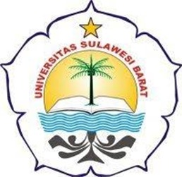

  <b>GoLowKer</b> 
  <i>(Platform Online Pencarian Lowongan Kerja)</i>  
    
  <b>Ahmad Habib Bukhori</b> 
  <b>D0223017</b>  
  Framework Web Based 
  2025

---

## Role dan Fitur-fiturnya

| Role  | Fitur                                                                                                                                   |
| ----- | --------------------------------------------------------------------------------------------------------------------------------------- |
| Admin | - Mengelola Data Pengguna (User & Perusahaan)   - Melihat Semua Lowongan & Lamaran Kerja   - Menghapus Postingan yang Melanggar Ketentuan   - Melihat siapa yang mendaftar agenda |
| User  | - Mengelola profil pribadi   - Melihat semua lowongan kerja yang tersedia   - Melamar ke lowongan yang diinginkan                    |
| Perusahaan | - Membuat, mengedit, dan menghapus lowongan kerja   - Melihat semua pelamar untuk lowongan yang dibuat   - Mengelola profil perusahaan (logo, deskripsi, dll.) |

---

## Struktur Tabel Database

### Tabel 1: [admins]

| Nama Field | Tipe Data    | Keterangan                        |
| ---------- | ------------ | --------------------------------- |
| id         | INT          | Primary key, auto increment       |
| name       | VARCHAR(255) | Nama lengkap Admin                |
| email      | VARCHAR(255) | Email unik untuk login            |
| password   | VARCHAR(255) | Password terenkripsi              |
| created_at | TIMESTAMP    | Waktu dibuat                      |
| updated_at | TIMESTAMP    | Waktu diperbarui                  |

---

### Tabel 2: [jobseekers]

| Nama Field | Tipe Data    | Keterangan                                                |
| ---------- | ------------ | --------------------------------------------------------- |
| id         | INT          | Primary key, auto increment                               |
| nama       | VARCHAR(255) | Nama lengkap pengguna                                     |
| email      | VARCHAR(255) | Email unik untuk login                                    |
| password   | VARCHAR(255) | Password terenkripsi                                      |
| admins_id  | INT          | ID pengguna yang didaftarkan (relasi ke tabel admins)     |
| phone      | VARCHAR(255) | no phone untuk dihubungi perusahaan                       |
| address    | TEXT         | Alamat lengkap pengguna                                   |
| created_at | TIMESTAMP    | Waktu dibuat                                              |
| updated_at | TIMESTAMP    | Waktu diperbarui                                          |

---

### Tabel 3: [company]

| Nama Field  | Tipe Data    | Keterangan                                                |
| ----------  | ------------ | --------------------------------------------------------- |
| id          | INT          | Primary key, auto increment                               |
| company_nama| VARCHAR(255) | Nama perusahaan                                           |
| email       | VARCHAR(255) | Email unik untuk login                                    |
| password    | VARCHAR(255) | Password terenkripsi                                      |
| admins_id   | INT          | ID company yang didaftarkan (relasi ke tabel admins)      |
| company_des | TEXT         | Informasi perusahaan                                      |
| website     | VARCHAR(255) | Memberikan link website untuk mengisi formulir            |
| address     | TEXT         | Alamat lengkap perusahaan                                 |
| created_at  | TIMESTAMP    | Waktu dibuat                                              |
| updated_at  | TIMESTAMP    | Waktu diperbarui                                          |

---

## Relasi Antar Tabel

-   Tabel [admins] memiliki relasi *one-to-many* dengan tabel [company].

    -   Foreign key: admins_id di [company] merujuk ke id di [admins].
    -   Penjelasan: Seorang admin bisa mengelola banyak perusahaan.

-   Tabel [jobseekers] memiliki relasi *one-to-many* dengan tabel [agenda_user].

    -   Foreign key: admins_id di [jobseekers] merujuk ke id di [admins].
    -   Penjelasan: Seorang admin juga bisa memantau banyak jobseeker.

---

<!-- 

## About Laravel

Laravel is a web application framework with expressive, elegant syntax. We believe development must be an enjoyable and creative experience to be truly fulfilling. Laravel takes the pain out of development by easing common tasks used in many web projects, such as:

- [Simple, fast routing engine](https://laravel.com/docs/routing).
- [Powerful dependency injection container](https://laravel.com/docs/container).
- Multiple back-ends for [session](https://laravel.com/docs/session) and [cache](https://laravel.com/docs/cache) storage.
- Expressive, intuitive [database ORM](https://laravel.com/docs/eloquent).
- Database agnostic [schema migrations](https://laravel.com/docs/migrations).
- [Robust background job processing](https://laravel.com/docs/queues).
- [Real-time event broadcasting](https://laravel.com/docs/broadcasting).

Laravel is accessible, powerful, and provides tools required for large, robust applications.

## Learning Laravel

Laravel has the most extensive and thorough [documentation](https://laravel.com/docs) and video tutorial library of all modern web application frameworks, making it a breeze to get started with the framework.

You may also try the [Laravel Bootcamp](https://bootcamp.laravel.com), where you will be guided through building a modern Laravel application from scratch.

If you don't feel like reading, [Laracasts](https://laracasts.com) can help. Laracasts contains thousands of video tutorials on a range of topics including Laravel, modern PHP, unit testing, and JavaScript. Boost your skills by digging into our comprehensive video library.

## Laravel Sponsors

We would like to extend our thanks to the following sponsors for funding Laravel development. If you are interested in becoming a sponsor, please visit the [Laravel Partners program](https://partners.laravel.com).

### Premium Partners

- **[Vehikl](https://vehikl.com/)**
- **[Tighten Co.](https://tighten.co)**
- **[Kirschbaum Development Group](https://kirschbaumdevelopment.com)**
- **[64 Robots](https://64robots.com)**
- **[Curotec](https://www.curotec.com/services/technologies/laravel/)**
- **[DevSquad](https://devsquad.com/hire-laravel-developers)**
- **[Redberry](https://redberry.international/laravel-development/)**
- **[Active Logic](https://activelogic.com)**

## Contributing

Thank you for considering contributing to the Laravel framework! The contribution guide can be found in the [Laravel documentation](https://laravel.com/docs/contributions).

## Code of Conduct

In order to ensure that the Laravel community is welcoming to all, please review and abide by the [Code of Conduct](https://laravel.com/docs/contributions#code-of-conduct).

## Security Vulnerabilities

If you discover a security vulnerability within Laravel, please send an e-mail to Taylor Otwell via [taylor@laravel.com](mailto:taylor@laravel.com). All security vulnerabilities will be promptly addressed.

## License

The Laravel framework is open-sourced software licensed under the [MIT license](https://opensource.org/licenses/MIT). -->

